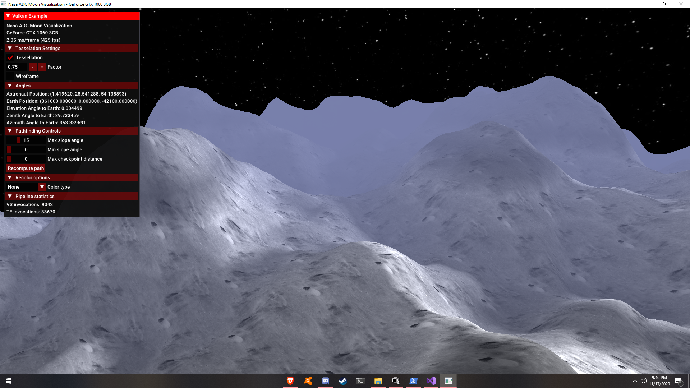
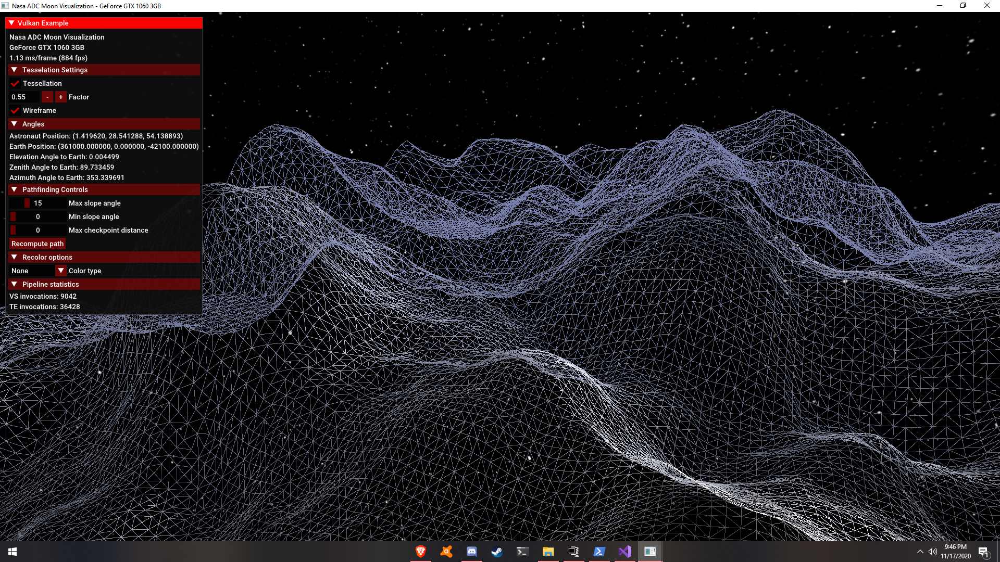

# Nasa-ADC-2020-RMHS

Submission to the Nasa ADC 2020

## Description

This project utilizes low level libraries such as the windows api, wayland, vulkan, etc. The point of this was to make the app run as efficiently as possible, while being as small as possible. The moonData given to us is not currently contained in the project because we had some difficulty getting it to the proper format, so for now the texture is random. The data is stored in an rgb ktx texture with red indicating height, making it an extremely efficient storage and loading method for the GPU. The app has a built in GUI with options, sliders, and headers. The first person camera is controlled with W, A, S, and D keys and a mouse Left Click. For now the pathfinding algorithm is in the program but is not being used due to the issue with the texture. We plan to resolve these issues to make the app fully functional.

The project utilizes Vulkan to render and Dear ImGui for the User Interface. These are contained in the base code writtedn by Sascha Williams in his Vulkan Example Github (Linked below). We plan to add the ability to add more shaders such as color heightmap shaders that make the higher points appear a different color than the lower, and another viewport containing a minimap of some sort to show larger points of interest for the astronaut.

Although our project may not be entirely developed yet, the increased developement time that comes from working in lower level programming is offset by the fact that little to know dependencies are needed, it can be compiled and run on embedded systems, and the entire program is only 850 KB! Additionally, the program is currently achieving over 800 frames on a GTX 1060 3 GB Graphics card!

## Screenshots




## Building

Project files for any IDE can be generated through cmake.
```
git clone --recursive https://github.com/GHawk1124/Nasa-ADC-2020.git
cd Nasa-ADC-2020/
```

### Windows

Use the provided CMakeLists.txt with [CMake](https://cmake.org) to generate a build configuration for your favorite IDE or compiler, e.g.:
```
cmake . -G "Visual Studio 16 2019"
```

### Mac

Use the provided CMakeLists.txt with [CMake](https://cmake.org) to generate a build configuration for your favorite IDE or compiler, e.g.:
```
cmake . -G "Xcode"
```

### Linux

Use the provided CMakeLists.txt with [CMake](https://cmake.org) to generate a build configuration for your favorite IDE or compiler, e.g.:
```
mkdir build && cd build
cmake .. -DCMAKE_BUILD_TYPE=release
make
```

## Acknowledgements
Huge thanks to Sascha Williams for providing an amazing place to start with his [Vulkan Examples](https://github.com/SaschaWillems/Vulkan)!
Huge thanks to Khronos for creating this wonderful software for us to use and their helpful [Vulkan Tutorial](https://vulkan-tutorial.com/)!
Thanks to our Mentors for helping us have this opportunity!
Finally, thanks to Nasa for hosting this event to help further our knowledge!
